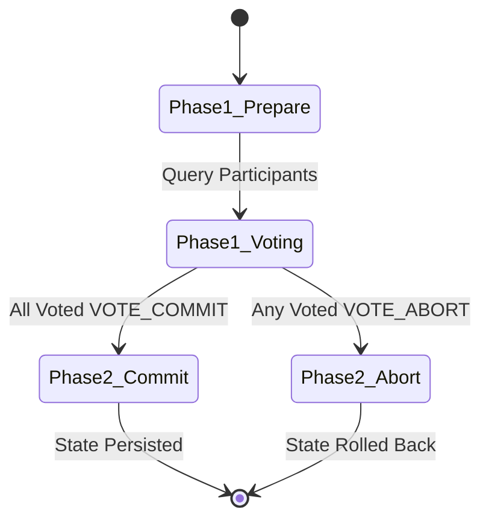

# 23 - Purely Functional Two-Phase Commit & STM Protocol (Haskell)

## Executive Overview
A fault-tolerant distributed transaction coordinator written in **pure Haskell (GHC 9.4+)**. It combines the **Two-Phase Commit (2PC)** consensus protocol with **Software Transactional Memory (STM)** (`TVar`, `atomically`, `retry`) to guarantee ACID properties and deadlock-free atomic cross-shard financial settlements.

## Transaction Consensus State Machine



### Source Tree
- **`src/Transactions.hs`**: Purely functional 2PC state machine and STM atomic coordination.
- **`distributed-transactions.cabal`**: Cabal build manifest.
- **`Setup.hs`**: Standard Haskell setup script.
- **`runner/run.js`**: Simulated 2PC execution harness validating commit/abort invariants.

## Native Haskell Compilation
```bash
cabal build
cabal run
# Or via GHC directly
ghc -O2 -threaded src/Transactions.hs -o transactions
./transactions
```

## Universal Verification
```bash
node runner/run.js
node orchestrator/run.js --project=23-haskell
```

## Senior Interview Q&A
- **Q: Why Software Transactional Memory (STM) over traditional mutexes?** Mutexes are prone to priority inversion, deadlocks, and race conditions. Haskell STM executes memory transactions optimistically; if a conflict occurs, `atomically` automatically rolls back and retries, guaranteeing deadlock freedom.
- **Q: How does 2PC handle coordinator crashes?** In-doubt participants consult write-ahead logs (`WAL`). If a coordinator crashes during Phase 2, participants can query backup coordinators to determine if a global commit or abort was logged.\n